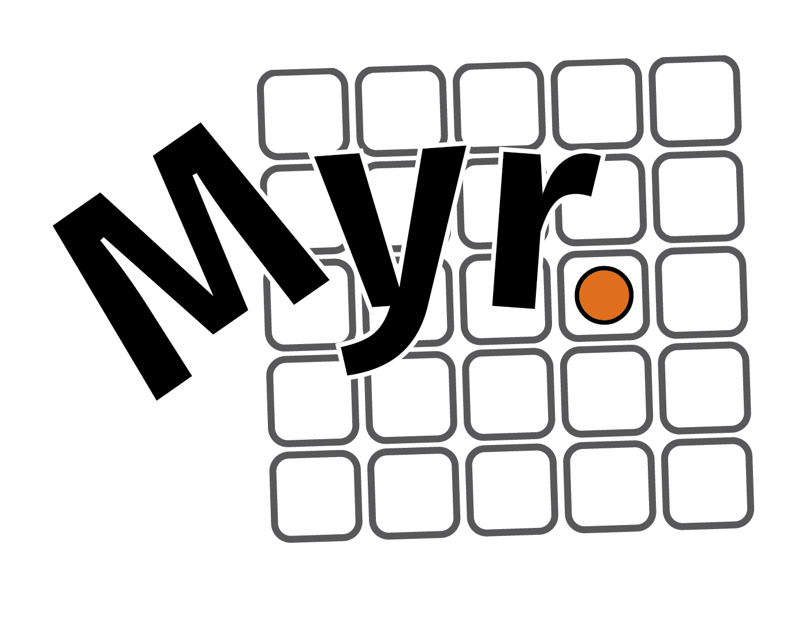

# megayear *research incubator*

Our fledgling research incubator is aimed at building new open source computational tools for astrophysics research.  
We are based at the University of Texas Department of Astronomy, in the Physics, Math, and Astronomy (PMA) building.  

## Current Software Architecture Projects

Our collective currently has four ongoing software architecture projects.

- [muler](https://muler.readthedocs.io/en/latest/) is a Python API for data from echelle spectrographs.
- [gollum](https://gollum-astro.readthedocs.io/en/latest/) is a Python API for precomputed sytnethetic stellar spectral models of stars and brown dwarfs.
- [blasé](https://blase.readthedocs.io/en/latest/) is a PyTorch-based framework that adapts machine learning to high-grasp stellar échelle spectroscopy. 
- [ynot](https://ynot.readthedocs.io/en/latest/) is an image-modeling framework for raw 2D echellograms aimed at precision extraction of low signal-to-noise ratio stellar spectra.

## People

[gully](http://gully.github.io) is the founding member of the research collective and a full-time research fellow at UT Austin.

We have a new group of students joining us for Spring 2022.  Stay tuned!  

### Recruiting new members for Fall 2022
We are recruiting new members for Fall 2022.  We seek UT Austin undergraduate or graduate students with some experience with Python programming.  Our incubator will help grow your skills and knowledge through practical open source computational astrophysics research.  To apply, please email gully or other group members with an introduction about yourself and your interests.  

## Core values

Our research incubator shares the [mission and values](https://www.utexas.edu/about/mission-and-values) of the University of Texas at Austin, expected of all students, faculty, and staff.  In addition to those, we have two key guiding principles specific to the technologies we produce, and how we produce them.

1. **Make our codes public, open source, and permissively licensed.**  
When feasible we make projects open source from the beginning.  At other times we may at first make a project private, with the intention of open sourcing it at a key milestone, such as the submission to a journal or publication of the paper.

2. **Make our research reproducible.**  
We specifically make our projects reproducible through the following steps.  We conduct all code conversations and contributions with public version control on GitHub.  We provide instructions or scripts for how to retrieve data and models from the original source.  When feasible, we provide raw and/or reduced example data.  We provide conda environments to reproduce the suite of dependencies needed to run a project.  We strive to write documentation, tutorials, README files, and other supporting documents to help others understand our research and makes its provenance transparent.

## Onboarding and computer setup

Modern astrophysics research takes lots of computer skills.  Some of the technologies are so new that they haven't had time to enter into the college curriculum.  We have to do lots of self-directed learning and experimentation to find out what's out there.  Here is a sketech of our evolving onboarding procedure.

### Computer and account setup

1. Make a [GitHub](https://github.com) account, provide your username to gully.
2. Sign up for the free-for-students [GitHub student developer pack](https://education.github.com/pack).  You may need to provide your student email to authenticate your educational status.
3. Install [GitKraken](https://www.gitkraken.com) on your computer, choose "Register with GitHub", and login with your GitHub account.  
4. On a Mac, install [iTerm2](https://iterm2.com).  On Windows install [PowerShell](https://docs.microsoft.com/en-us/powershell/scripting/install/installing-powershell-on-windows?view=powershell-7.2)
5. On a Mac, install Xcode CLI: `xcode-select --install`.  On Windows, install [git for Windows](https://git-scm.com/download/win).
6. Install the [atom editor](https://atom.io).
7. Install [VS Code](https://code.visualstudio.com).
8. On a Mac, install [Homebrew](https://brew.sh).
9. Install [direnv](https://direnv.net).
10. Install [miniconda](https://docs.conda.io/en/latest/miniconda.html)
11. Make a free account on [Overleaf](https://www.overleaf.com) if you don't already have one.

Optional, but you'll need them eventually...

12. Make an [ORCID](https://orcid.org) account.
13. Make an account on [ArXiv](https://arxiv.org/login).
14. Make an account on [readthedocs](https://readthedocs.org).
15. Make an account on [PyPI](https://pypi.org).

### Understanding and Customizing your dotfiles
Software development customizations primarily occur in so-called "dotfiles".  Here is a helpful post explaining [what dotfiles are are and how to customize them for mac/linux](https://www.freecodecamp.org/news/dotfiles-what-is-a-dot-file-and-how-to-create-it-in-mac-and-linux/).  The main thing we will want to do is make it easy for you to see your git changes at-a-glance.  This process is pretty subtle and it is probably worth doing this step with the help of an experienced programmer (ask gully).  Our goal is to get your commandline prompt to resemble the screenshot on this [README](https://github.com/mathiasbynens/dotfiles).  While this step may seem vain, in the long term these changes make it easier to experiment by promoting good git hygiene.

### Building experience with git and GitHub
Reproducible research is one of our core values.  We therefore place tremendous emphasis on using `git` and GitHub to conduct virtually all of our conversations and contributions about the project.  `git` and GitHub take some practice to get used to, and so learning them is your first major onboarding assignment.  Luckily there are tons of high-quality tutorials online for learning them.  

As part of your onboarding you must complete one of the online tutorials for git/GitHub from this list:

1. [UTexas git/GitHub training](https://ut.service-now.com/sp?id=ut_bs_service_detail&sys_id=16d65c7c4ff9d200f6897bcd0210c786) on UT Canvas: "Don’t Be Afraid to Commit: Intro to Git-GitHub"
2. [GitHub labs](https://lab.github.com)
3. Codecademy Pro free trial [Learn git/GitHub](https://www.codecademy.com/learn/learn-git)
4. Pluralsight 10-day free trial [Getting started with git](https://www.pluralsight.com/courses/git-getting-started)
5. [GitKraken learn git](https://www.gitkraken.com/learn/git)
6. O'Reilly online [git training](https://www.katacoda.com/courses/git)

You may want to experiment with a few of these to get a feel for it.

### Practice with Python libraries
The Python libraries you'll need will depend on your project.  In general, everyone should have some practice with the three most important libraries for data analysis with Python: `numpy`, `matplotlib`, and `pandas`.

Here are some useful tutorials:
- [numpy tutorials](https://numpy.org/learn/)
- [numpy challenges](https://www.hackerrank.com/domains/python/numpy/difficulty/all/page/1) on Hackerrank
- [learn pandas](https://www.kaggle.com/learn/pandas) on Kaggle
- [learn matplotlib](https://www.codecademy.com/learn/data-visualization-python/modules/dspath-matplotlib) on codecademy

Search around the internet and libraries for a learning path that works for you.